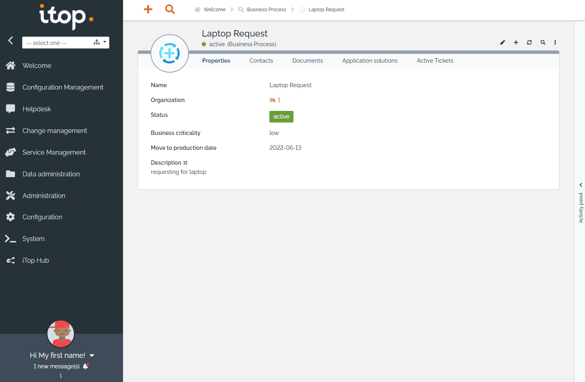

# iTop CI/CD pipeline

Deploy iTop with CI/CD on Elestio

 
 

# First use

To use iTop, you must register.
Here's how to do it:

- Click on continue
- Install a new iTop
- Accept all checkboxes and continue
- for the database use these credentials:

        Server Name: 172.17.0.1:35700
        Login: root
        Password [ADMIN_PASSWORD]

- Once you have a success message, choose `Use the existing database` with database `itop`, then click on next

- For the Administration account, you can use theses credentials:

        Login: admin
        Password: [ADMIN_PASSWORD]

- In the next page, make sure that on Application section, url is `https://[CI_CD_DOMAIN]/` and click on `I am installing a production instance, create an empty database to start from.`

- On `Configuration Management options` click next
- On `Service Management options` click next
- On `Tickets Management options` click next
- On `Change Management options` click next
- On `Additional ITIL tickets` click on both checkboxes then click next
- On `Ready to install` click install

# Once deployed ...

You can open iTop ADMIN UI here:

    URL: https://[CI_CD_DOMAIN]
    email: [ADMIN_EMAIL]
    password: [ADMIN_PASSWORD]

You can open PHPMyAdmin web UI here:

    URL: https://[CI_CD_DOMAIN]:48152
    email: root
    password: [ADMIN_PASSWORD]

# SMTP configuration

To configure the SMTP, go to `Confiugration` section on the left tab, and choose `General Configuration`

A configuration File Editor will appear.

Search

    'email_transport' => 'PHPMail',

Change it to

    'email_transport' => 'SMTP',
    'email_transport_smtp.host' => '172.17.0.1',
    'email_transport_smtp.port' => '25',

Then search

    'email_default_sender_address' => ''

Change it to

    'email_default_sender_address' => '[DOMAIN]@vm.elestio.app'

Apply 

To test it, you can go to the `Notification` section that is in `Confiugration` section on the left tab, and click on `email.test.php`
